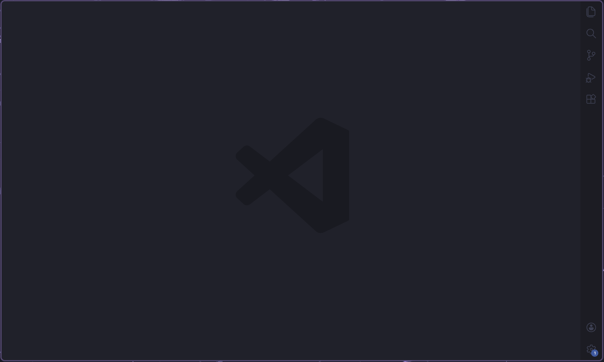

# 👾 VSCode-config 👾


Welcome to my config for Visual Studio Code. I tried to make it more minimalistic, leaving only the necessary things.

## 👀 Preview



## 📦 Installation
Copy my configuration files to your VSCode user folder

### Default paths by OS:
**Linux:**
```
~/.config/Code/User/settings.json
```
**Windows:**
```
C:\Users\<Имя_пользователя>\AppData\Roaming\Code\User\settings.json
```
**macOS:**
```
~/Library/Application Support/Code/User/settings.json
```

### 🔍 How to find your settings file
You can also open the settings file directly in VSCode:
1. Press `Ctrl+Shift+P` (or `Cmd+Shift+P` on macOS)
2. Type **"Open User Settings (JSON)"**
3. Select it from the command palette
